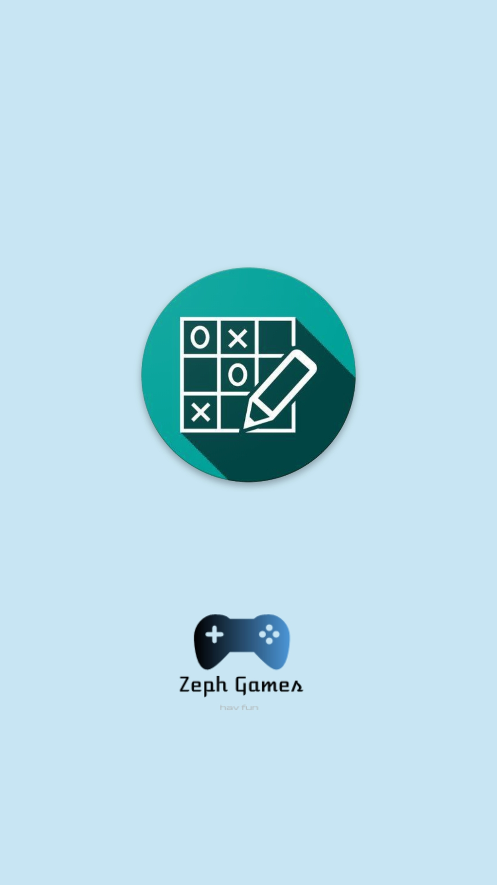
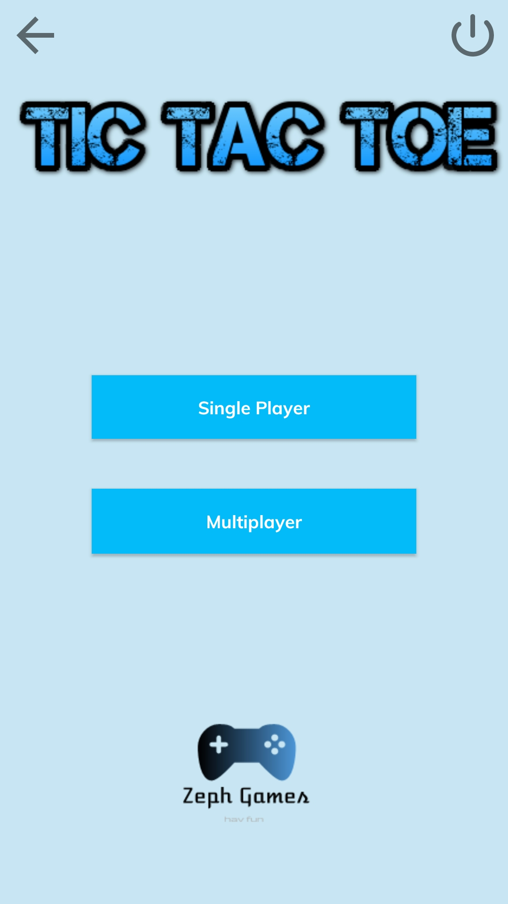
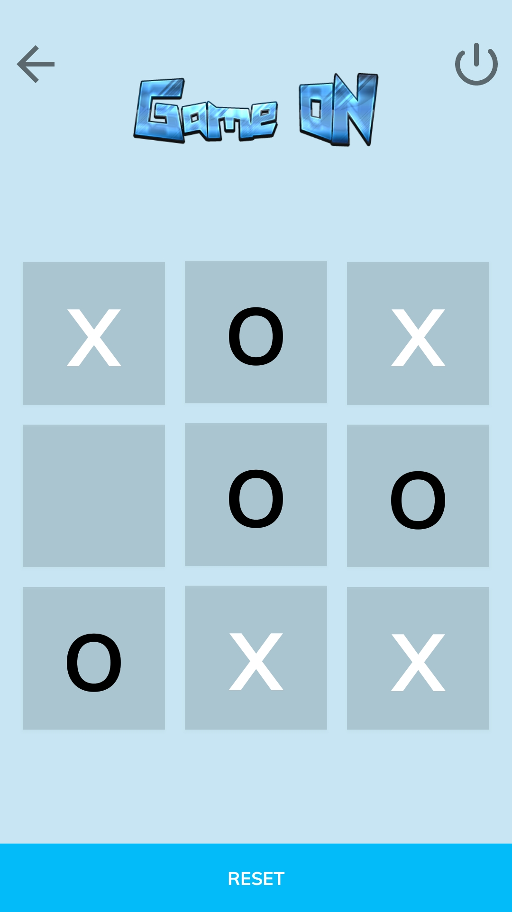

# Tic Tac Toe app

[](https://github.com/ashish7zeph/android-kotlin-TicTacToe-game/blob/master/LICENSE)
[](https://github.com/ashish7zeph/android-kotlin-TicTacToe-game/graphs/contributors)
[](https://kotlinlang.org/)

[](https://www.android.com/)

## Overview

Build a Tic Tac Toe android app with kotlin support

It is the regular Tic Tac Toe game with two gameplay modes `Multiplayer` for two players and another `Single Player` for one player playing against a computer algorithm

Its a fun game!!

## Features

* Single player mode
* Multi player mode
* Splash screen
* Animation styles
* Minimal Design
* Simplified Theme
* Responsive BackPress

## Platform
        -> Android Studio
        -> With Kotlin Support

## Instructions

1. Clone or download the repo: `https://github.com/ashish7zeph/android-kotlin-TicTacToe-game`
2. Navigate to the folder `android-kotlin-TicTacToe-game`
3. Navigate to the folder `android-kotlin-TicTacToe-game/app/src/` to access developers content
3. Navigate to the folder `apk` for users to access apk
4. Copy the apk from folder `apk` to an android phone
5. Install the apk

The app is finally installed on your Android mobile device !!
To directly download the apk visit the [link](https://github.com/ashish7zeph/android-kotlin-TicTacToe-game/tree/master/apk)

 # Screenshots:

<div style="display:flex;">



</div>

## Kotlin Android Activity

Kotlin code of the splash screen activity in this project is shown below. For kotlin code of other activities visit the [link](https://github.com/ashish7zeph/android-kotlin-TicTacToe-game/tree/master/app/src/main/java/com/zeph7/tictactoe)

```kotlin
    package com.zeph7.tictactoe

    import android.content.Intent
    import android.support.v7.app.AppCompatActivity
    import android.os.Bundle
    import android.os.Handler
    import android.view.Window
    import android.view.WindowManager
    import android.view.animation.AnimationUtils
    import kotlinx.android.synthetic.main.activity_splash.*

    class SplashActivity : AppCompatActivity() {

        override fun onCreate(savedInstanceState: Bundle?) {
            super.onCreate(savedInstanceState)

            window.requestFeature(Window.FEATURE_NO_TITLE)

            window.setFlags(WindowManager.LayoutParams.FLAG_FULLSCREEN,
                    WindowManager.LayoutParams.FLAG_FULLSCREEN)

            setContentView(R.layout.activity_splash)

            val anim = AnimationUtils.loadAnimation(applicationContext, R.anim.zoom)
            imageViewLogo.startAnimation(anim)

            Handler().postDelayed({
                startActivity(Intent(this@SplashActivity, MainActivity::class.java))
            }, 5000)
        }
    }
```
